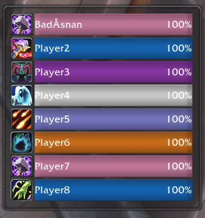

# BGFoes

World of Warcraft addon that shows battleground enemy frames. A lightweight zero config alternative to [BattlegroundEnemies](https://www.curseforge.com/wow/addons/battlegroundenemies).

## Features

* Show spec icon and healthbars of enemy players inside battlegrounds
  * Target enemy on left click
  * Set focus target on right click

## Maybe future features

* Icons/marker for orb and flag carriers
* PVP trinket CD tracker
* Resize frame

Most other things I will probably not consider adding, as I want to keep this addon lean.

## Screenshot

